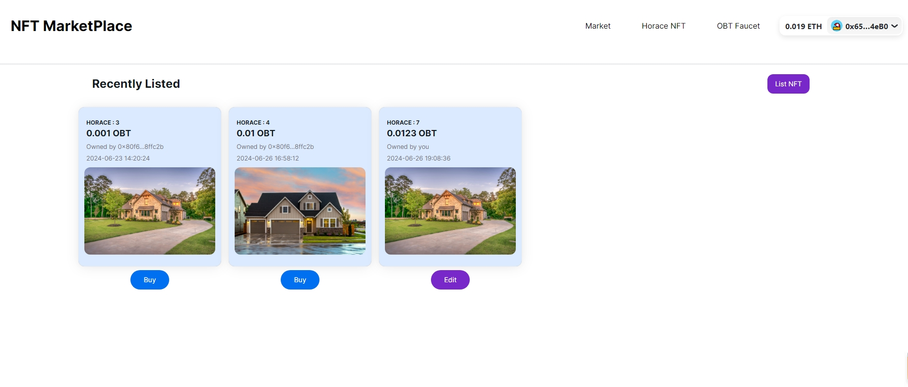

# NFT Market Project 

## backend_graph
    
> 通过 [thegraph](https://thegraph.com/)  平台 索引了OBToken的交易记录数据；HoraceNFT 的用户NFT数据；NFTMarket 的上架数据；用于页面列表数据展示；

## contracts

> hardhat + openzeppelin 开发，测试，部署 solidity合约
    
- OBtoken.sol ERC20,ERC20Permit TOKEN；permit 方法可以通过链下签名的方式进行授权，减少NFT购买环节的一次授权操作;
- HoraceNFT.sol ERC721 一个简单的NFT用于Market交易; 
    `TODO ：未来可以加入 EIP712 协议，简化上架授权流程 ` 
- NFTMarket.sol nft市场合约；实现了上架，下架，购买，修改等功能；

## frontent 

> nextjs + TS + wagmi + rainbowkit + nextui + ……

 - 前端框架：nextjs + TS + nextui + tailwindcss 
 - 合约交互：wagmi + rainbowkit + viem
 - thegraph交互：apollo/client + graphql

[Try it out](https://nft-market-delta-hazel.vercel.app/)

